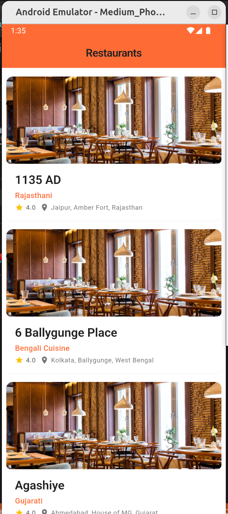
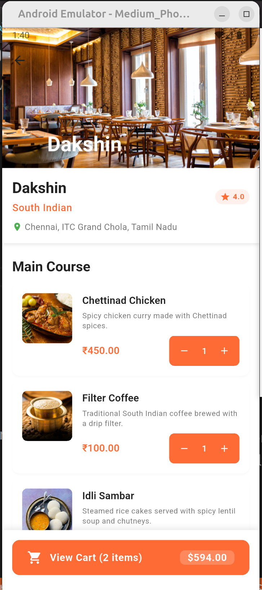
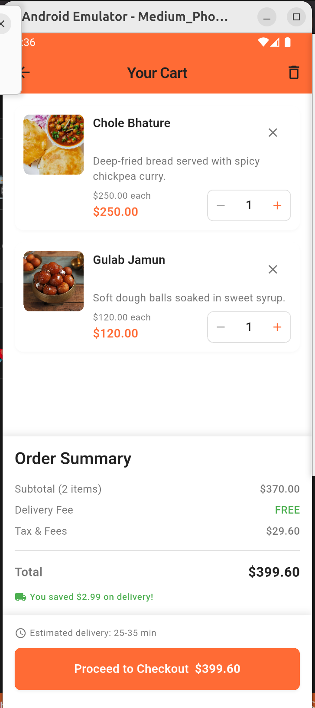
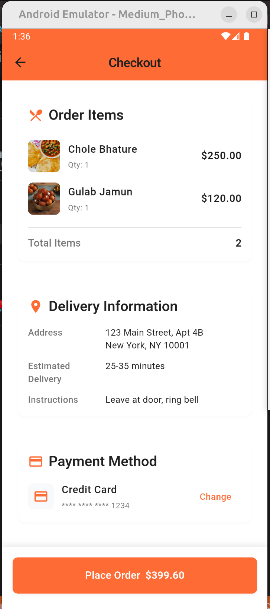
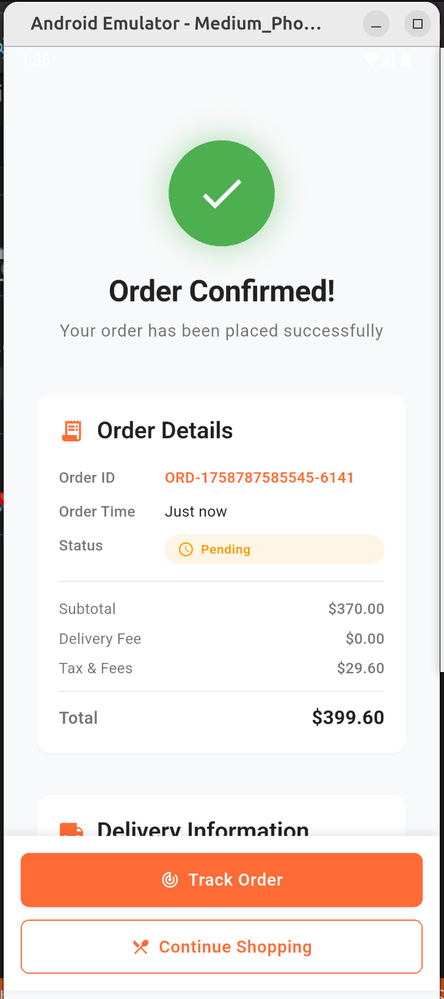

# 🍔 Food Ordering Workflow App

A Flutter application simulating a food ordering workflow similar to Swiggy/Zomato.  
Built using **Flutter**, **BLoC architecture**, and integrated with the **FakeRestaurantAPI** for mock restaurant and menu data.

---

## 🚀 Features

- Fetch and display a list of restaurants
- View restaurant-specific menus
- Add/remove items from the cart
- Checkout with order summary
- Order confirmation screen (success/failure)
- Error handling for API failures
- Clean architecture with **SOLID principles**
- Unit tests for cart and order logic

---

## 🛠️ Tech Stack

- Flutter (UI framework)  
- Dart (programming language)  
- flutter_bloc (state management)  
- http (API calls)  
- FakeRestaurantAPI (mock data source)  
- Unit Testing with `flutter_test`


## 📂 Project Structure
```
lib/
├─ main.dart
├─ models/
│ ├─ restaurant.dart
│ └─ menu_item.dart
├─ repositories/
│ └─ restaurant_repository.dart
├─ blocs/
│ ├─ restaurant_bloc.dart
│ └─ cart_bloc.dart
├─ ui/
│ ├─ screens/
│ │ ├─ restaurant_list_screen.dart
│ │ ├─ menu_screen.dart
│ │ ├─ cart_screen.dart
│ │ ├─ checkout_screen.dart
│ │ └─ order_confirmation_screen.dart
│ └─ widgets/
│ ├─ restaurant_card.dart
│ ├─ menu_item_card.dart
│ └─ cart_item_card.dart
└─ utils/
└─ api_endpoints.dart
```

## 🔗 API Reference

- Base URL: `https://fakerestaurantapi.runasp.net/api`  
- Endpoints:  
  - `GET /Restaurant` → list of restaurants  
  - `GET /Restaurant/{id}/menu` → menu items for a restaurant  

---

## 🧪 Running Tests

Run all tests:

```bash
flutter test
````

---

## ▶️ How to Run

1. Clone the repository:

```bash
git clone https://github.com/Dhiraj706Sardar/mini_delivery_app.git
cd food-ordering-app
```

2. Install dependencies:

```bash
flutter pub get
```

3. Run the app:

```bash
flutter run
```

4. Build the apk
```
flutter build apk --debug
```
---

## 📸 Screenshot

<table>
  <tr>
    <td></td>
        <td></td>
    <td></td>
    <td></td>
    <td></td>
  </tr>
</table>


---

## 📌 Notes

* This project is a **demo workflow** only (no login, no real payments).
* Data is fetched from a **mock API** and may not always be consistent.


